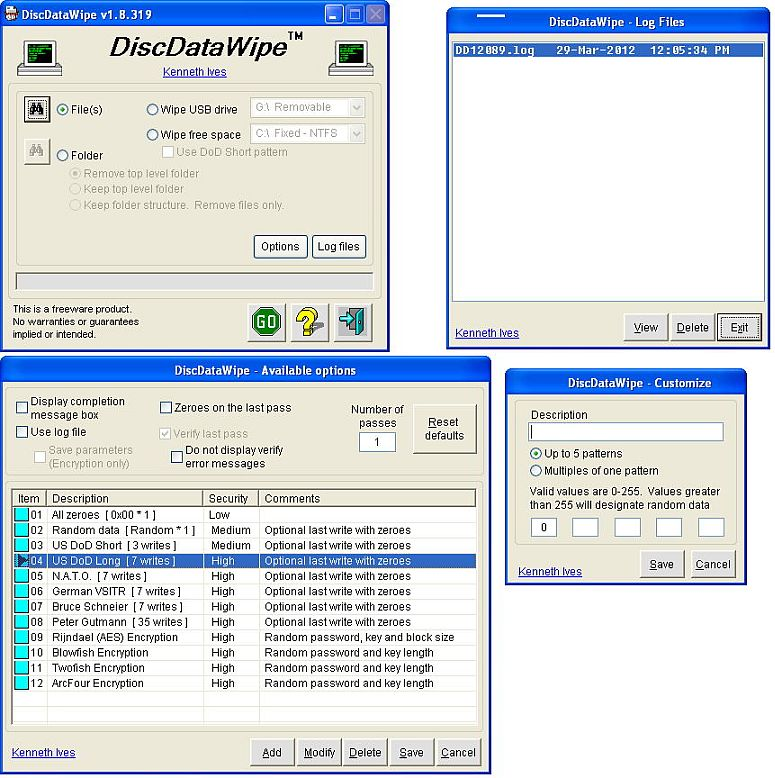



## Disk Data Wipe  15\-Jun\-2012

### Description

Remove files and folders completely using one of twelve different options. You can also define your own. This is well documented.

=== 30-Mar-2012 Updated documentation. Added modTrimStr.bas module.

=== 07-May-2012 Updated clsRandom module. Speed processing of random data.

=== 15-Jun-2012 Updated support modules.
 
### More Info
 

             |
---                |---
**Submitted On**   |2012-06-14 18:38:20
**By**             |[Kenaso](https://github.com/Planet-Source-Code/PSCIndex/blob/master/ByAuthor/kenaso.md)
**Level**          |Advanced
**User Rating**    |5.0 (35 globes from 7 users)
**Compatibility**  |VB 6\.0
**Category**       |[Complete Applications](https://github.com/Planet-Source-Code/PSCIndex/blob/master/ByCategory/complete-applications__1-27.md)
**World**          |[Visual Basic](https://github.com/Planet-Source-Code/PSCIndex/blob/master/ByWorld/visual-basic.md)
**Archive File**   |[Disk\_Data\_2224916142012\.zip](https://github.com/Planet-Source-Code/kenaso-disk-data-wipe-15-jun-2012__1-73493/archive/master.zip)

